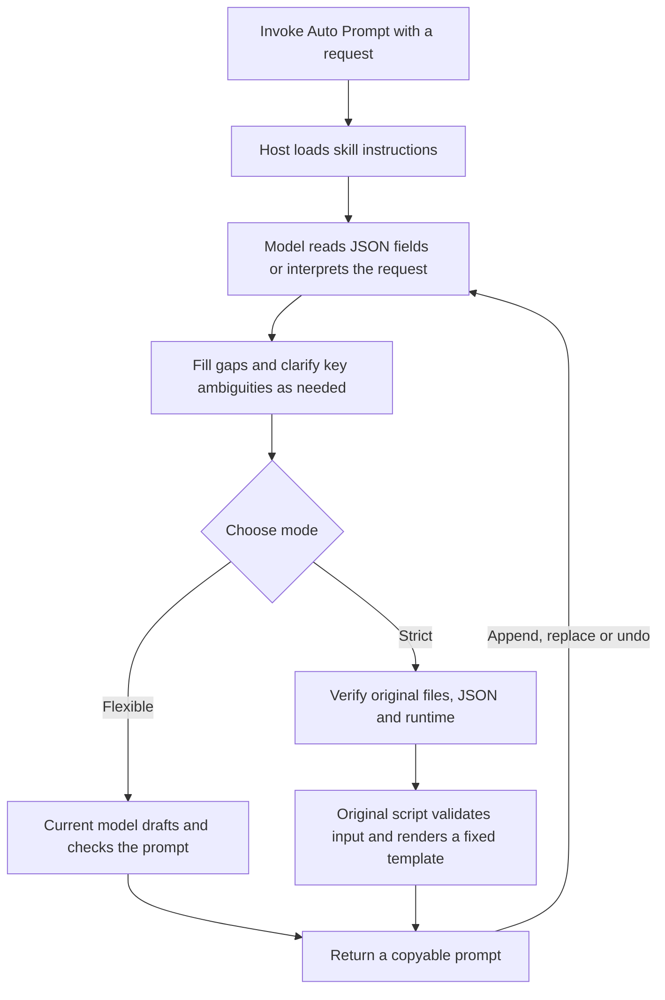

# Auto Prompt Skill · v1.1.1

Turn a target agent and a rough request into a copyable prompt in ChatGPT. For people who want to clarify goals, constraints and deliverables before handing a task to Codex, ChatGPT or a video model. Covers software, study, research, writing and video.

[Download v1.1.1](https://github.com/Saki-174/auto-prompt-skill/releases/tag/v1.1.1) · [Installation guide (Chinese)](docs/install.md) · [Usage guide (Chinese)](docs/usage.md) · [Documentation index (Chinese)](docs/README.md) · [中文](README.md)

## What it does

- Preserves requests and constraints, marks missing information and avoids inventing project facts or agent capabilities.
- Guides incomplete requests in short rounds and clarifies important ambiguities.
- Appends, replaces or undoes requirements, or starts a new task.
- Uses flexible rewriting by default, with explicitly selected strict script rendering.

The skill converts prompts; it does not execute their business tasks. The **host** loads the skill; the **target agent** receives the generated prompt. They may differ.

## Installation: choose your ChatGPT environment

| Environment | Download and entry point |
| --- | --- |
| ChatGPT in a Windows browser | [plugin.zip](https://github.com/Saki-174/auto-prompt-skill/releases/download/v1.1.1/auto-prompt-skill-1.1.1-plugin.zip) → Plugins → top-right `+` → Upload plugin |
| Windows x64 desktop app, local Work | [bundle.zip](https://github.com/Saki-174/auto-prompt-skill/releases/download/v1.1.1/auto-prompt-skill-1.1.1-bundle.zip) → Extract → `Install-Windows.cmd` → enable in the client |

The account, workspace and client must expose the relevant features. Verify `SHA256SUMS.txt` using the [installation guide](docs/install.md) before installing. The skill-only ZIP is for existing skill-import mechanisms; GitHub Source code is for development. Neither is the recommended download for the two routes above.

### Web: upload the plugin

Keep the ZIP compressed, import through Upload plugin, then open Personal → Created by me → Auto Prompt Skill and complete installation. Start a new chat and select the actual plugin or skill. See the [web guide](docs/install.md#一windows-电脑浏览器网页版安装) for controls, success checks and troubleshooting.

The plugin ZIP includes scripts and templates but does not prepare Python. Strict execution needs tools, verified original files and a maintained interpreter in the actual execution environment. Local setup does not automatically repair a cloud interpreter. Web dependencies and full execution remain independently unverified; see [validation limits](docs/validation.md#网页版验证边界).

### Desktop: install locally

Run setup from the extracted directory. After `严格脚本自检：通过` (strict self-test passed), refresh the client plugin, choose the local source printed by setup, install or update Auto Prompt Skill and open a new Work chat connected to this computer. See the [desktop guide](docs/install.md#二windows-桌面客户端本地安装).

Setup reuses Python meeting the [maintenance policy](docs/security-maintenance.md#运行时维护), or downloads and verifies pinned official Python 3.13.16 Windows x64 into a dedicated directory (about 10.9 MB). A verified official ZIP supports offline preparation. Shared Python, global PATH and the registry are unchanged; no pip, npm, Docker, Ollama or persistent service is needed. Install, sign in, authorize and enable the host yourself. Setup checks do not replace a new-chat acceptance check.

## Everyday use

Send this in a ChatGPT chat where the skill is enabled:

~~~text
Please use Auto Prompt.
Target agent: ChatGPT
Request: Teach probability to a beginner with everyday examples, then two practice questions.
Constraints: English, no calculus. Withhold answers until I respond, then review my work.
~~~

You can invoke the skill alone for guidance. After generation, say Append…, Replace… or Undo the last change. New task starts another request; Use it as is ends conversion. See the [usage guide](docs/usage.md) for modes and revision rules.

## How it works

Complete input without key ambiguity is processed directly; invoking only the skill starts guidance. If strict mode lacks execution tools, verified original files or a maintained runtime, it reports that execution did not occur. Model-generated text cannot stand in for script output.

- The **model** interprets, clarifies, rewrites flexibly and handles conversational revisions. Naming a target agent neither switches the current model nor calls that agent.
- **Skill instructions** define information preservation, clarification, structure and checks. The plugin includes no generation model and calls no external model API.
- The **strict script** validates input and renders fixed templates. Identical JSON produces identical output with fixed scripts and templates; converting natural language to JSON still depends on the model.

Flexible quality depends jointly on the current model, skill instructions, input completeness and visible context. No evaluation currently supports a fixed influence percentage or a cross-model ranking. See [runtime responsibilities and quality limits (Chinese)](docs/runtime.md).

## Flexible and strict modes

Natural language defaults to flexible rewriting by the current model. Explicit strict mode guarantees identical UTF-8 output for identical JSON under fixed scripts and templates. Natural-language extraction and semantic correctness are outside that guarantee.

The four Chinese/English development/general templates and legacy CLI defaults remain. Complete old JSON without `strictMode` still means `true`. The skill clarifies conflicts with legacy language rules or template permissions; the direct CLI does not. Strict mode requires real execution of the original renderer, not model rewriting. See [mode limits](docs/usage.md#严格模式) and the [input protocol](skills/auto-prompt/references/input.md).

## Upgrade, recovery and other installation routes

v1.1.1 preserves Windows permissions and protects backups and temporary files; see [release notes](docs/releases/v1.1.1.md). Local sources and web personal entries are updated separately, not automatically by a GitHub release.

The [maintenance guide](docs/maintenance.md) covers updates, customization conflicts, old transaction compatibility, offline preparation, rollback, uninstall and manual routes. Historical v1.0.2 has same-version revisions: version strings alone do not identify files. Automatic runtime preparation is Windows x64 only; full host or platform acceptance is not claimed.

## Development and validation

See [project structure](docs/project-structure.md) for modules and package scopes, and [development](docs/development.md) for commands and checks. Core scripts use the Python standard library. Public-file allowlists exclude runtimes, user configuration, backups and machine logs.

[Validation](docs/validation.md) separates published evidence from unverified capabilities. Real conversations require [host acceptance](docs/chatgpt-acceptance.md), [dialogue regression](docs/conversation-regression.md) and [quality comparisons](docs/prompt-quality.md).

## License and sources

The project uses the [ISC license](LICENSE). Clarification behavior is partly adapted from mattpocock/skills grill-me/grilling; pinned source, MIT license and adaptation scope are in [attribution](skills/auto-prompt/references/grill-me-attribution.md).

The optional runtime comes from the [official pinned Python release](https://www.python.org/downloads/release/python-31316/) and retains `LICENSE.txt`. The bundle contains no interpreter. See [OpenAI skills documentation](https://learn.chatgpt.com/docs/build-skills) and the [migration guide](docs/migration.md) for legacy services and shared dependencies.
