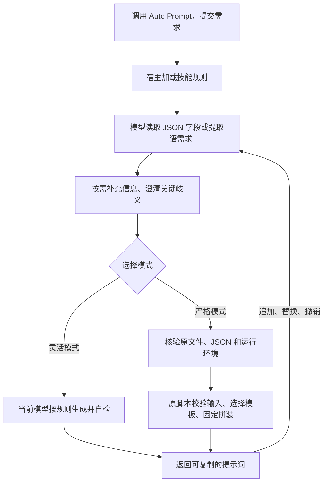

# Auto Prompt Skill · v1.1.1

在 ChatGPT 中把“目标 Agent＋口语化需求”整理成可复制的提示词。适合需要先说清目标、约束和交付物，再交给 Codex、ChatGPT 或视频模型的人；支持开发、学习、研究、写作和视频需求。

[下载 v1.1.1](https://github.com/Saki-174/auto-prompt-skill/releases/tag/v1.1.1) · [安装教程](docs/install.md) · [使用教程](docs/usage.md) · [文档导航](docs/README.md) · [English](README.en.md)

## 能做什么

- 保留需求和约束，标明缺失信息，不编造项目事实或目标 Agent 的能力。
- 简短引导与关键歧义澄清；已有信息直接复用。
- 追加、替换、撤销要求，或切换新任务。
- 日常灵活改写；明确选择严格模式时使用固定脚本和模板。

技能只转换提示词，不执行其中的业务任务。**运行宿主**加载技能，**目标 Agent**接收生成结果，两者可以不同。

## 安装：选择你的 ChatGPT 环境

| 环境 | 下载与操作入口 |
| --- | --- |
| Windows 浏览器中的 ChatGPT 网页版 | [plugin.zip](https://github.com/Saki-174/auto-prompt-skill/releases/download/v1.1.1/auto-prompt-skill-1.1.1-plugin.zip) → 插件页右上角`＋` → 上传插件 |
| Windows x64 桌面客户端，本地 Work | [bundle.zip](https://github.com/Saki-174/auto-prompt-skill/releases/download/v1.1.1/auto-prompt-skill-1.1.1-bundle.zip) → 解压 → `Install-Windows.cmd` → 客户端启用 |

账号、工作区和客户端必须提供对应入口。下载后先按[安装教程](docs/install.md)核对`SHA256SUMS.txt`。单技能包面向已有技能导入方式，GitHub Source code 面向源码开发，均不是上表路径的推荐下载项。

### 网页版：上传插件

保持 ZIP 压缩状态，在“上传插件”中选中文件；导入成功后打开“个人 → 我创建的 → Auto Prompt Skill”，完成安装，再新建聊天选择实际插件或技能。详细界面、成功标志和排错见[网页安装](docs/install.md#一windows-电脑浏览器网页版安装)。

网页插件包包含脚本和模板，不准备 Python。严格执行还需当前环境的工具、来源可核验的原文件及合规解释器；本机安装不自动修复云端。网页依赖和完整执行能力尚未独立验收，见[验证边界](docs/validation.md#网页版验证边界)。

### 桌面客户端：本地安装

在解压文件夹运行安装器，看到“严格脚本自检：通过”后刷新客户端插件，选择安装器打印的本地来源，安装或更新 Auto Prompt Skill，再新建连接本机的 Work 聊天。具体步骤见[桌面安装](docs/install.md#二windows-桌面客户端本地安装)。

安装器复用符合[维护策略](docs/security-maintenance.md#运行时维护)的 Python，否则下载校验固定的 Python 3.13.16 Windows x64 专属运行时，约 10.9 MB；可预先携带官方 ZIP 离线准备。不修改共享 Python、全局 PATH 或注册表，无需 pip、npm、Docker、Ollama 或常驻服务。宿主安装、登录、授权和启用需自行完成；安装自检不替代新聊天验收。

## 日常使用

在已启用技能的 ChatGPT 聊天框发送：

~~~text
请使用 Auto Prompt。
目标 Agent：ChatGPT
需求：帮初学者学习概率，先用生活例子解释，再给两道练习题。
约束：中文，不用微积分，先不附答案，等我作答再批改。
~~~

也可以只调用技能后按引导补充。生成后说“追加……”“替换……”或“撤销刚才修改”；“换个任务”开始新需求，“直接使用”结束转换。模式、完整示例和修订规则见[使用教程](docs/usage.md)。

## 运行逻辑

完整输入没有关键歧义时直接处理；只调用技能时先引导。严格模式缺少执行工具、可核验的原文件或合规运行时，则说明“未执行”，不会用模型生成内容冒充脚本结果。

- **模型**负责理解、澄清、灵活改写及对话修订；填写目标 Agent 不会切换当前模型或调用目标 Agent。
- **技能规则**约定保留哪些信息、何时追问、如何组织与核对结果；插件不自带生成模型，也不调用外部模型 API。
- **严格脚本**负责输入校验和固定模板渲染；相同 JSON 在固定脚本与模板下输出一致，自然语言到 JSON 的提取仍依赖模型。

灵活模式的质量受当前模型、技能规则、输入完整度和可见上下文共同影响；目前没有可支持固定影响百分比或跨模型排名的评测。详细分工、执行前置条件与质量边界见[运行逻辑说明](docs/runtime.md)。

## 灵活模式与严格模式

自然语言默认灵活模式，由当前模型理解并改写。严格模式需明确选择，保证固定脚本和模板下相同 JSON 得到相同 UTF-8 输出；自然语言抽取及语义正确性不在确定性保证内。

四套中英文开发／通用模板和旧 CLI 默认值保留；完整旧 JSON 缺省`strictMode`仍按`true`。语言或权限要求与旧模板冲突时先澄清，直接 CLI 不做语义澄清。严格模式需要实际执行原脚本，不能用模型改写代替。详见[模式边界](docs/usage.md#严格模式)和[输入协议](skills/auto-prompt/references/input.md)。

## 升级、恢复与其他安装方式

v1.1.1 保留 Windows 访问权限，保护备份与临时文件，升级限制见[发布说明](docs/releases/v1.1.1.md)。本地来源和网页个人条目分别更新，不由 GitHub 发布自动同步。

升级、自定义文件冲突、旧事务兼容、离线准备、回滚、卸载和其他平台手动路径统一见[维护说明](docs/maintenance.md)。历史 v1.0.2 有同版本修订，不能只用版本号判断文件是否更新。自动运行时准备仅限 Windows x64，不宣称全部宿主或平台已验收。

## 开发与验证

模块、目录和分发范围见[项目结构](docs/project-structure.md)，命令与检查入口见[开发与验证](docs/development.md)。核心脚本仅用 Python 标准库；发布包按白名单构建，不包含运行时、用户配置、备份或机器日志。

[验证说明](docs/validation.md)区分已发布证据与未验证能力；真实对话还需[宿主验收](docs/chatgpt-acceptance.md)、[对话回归](docs/conversation-regression.md)和[质量对照](docs/prompt-quality.md)。

## 许可与来源

项目主体采用[ISC 许可证](LICENSE)。澄清机制局部改编自 mattpocock/skills 的 grill-me／grilling，固定来源、MIT 许可和改编范围见[来源说明](skills/auto-prompt/references/grill-me-attribution.md)。

可选运行时来自[Python 官方固定版本](https://www.python.org/downloads/release/python-31316/)，保留原包`LICENSE.txt`；整合包本身不附解释器。技能机制参见[OpenAI skills 文档](https://learn.chatgpt.com/docs/build-skills)。旧服务和共用依赖边界见[迁移说明](docs/migration.md)。
